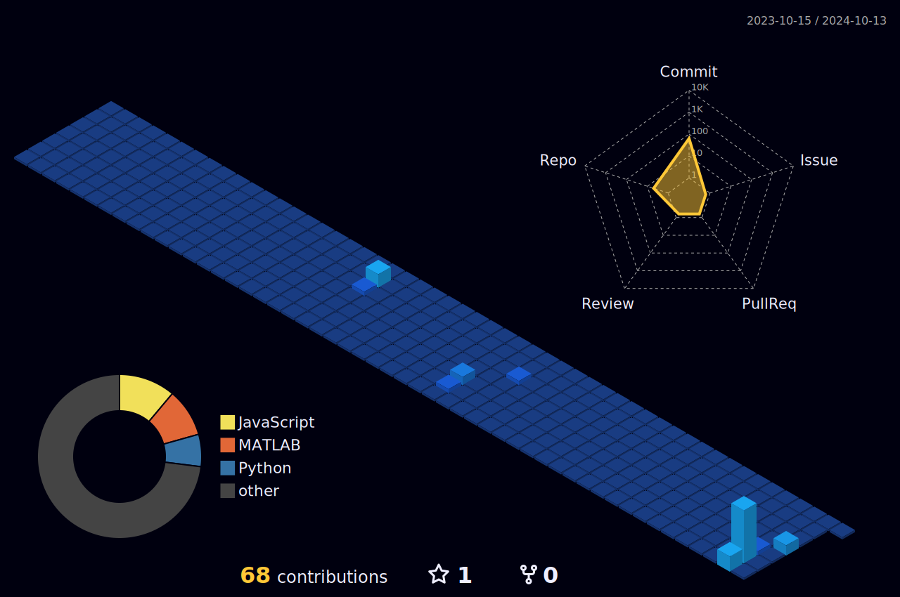

## Hi there 👋

## Skills
- **Languages**: Python, MATLAB, C++, Julia, C, Swift, HTML, CSS, Ruby on Rails
- **Optimization**: Mosek, YALMIP, Gurobi
- **CAD**: SolidWorks, AutoCAD
- **Software**:  Simulink, ROS 2, PX4, Gazebo, XFOIL, Unity, Open VSP, Open Rocket
- **Tools**: Git, Microsoft Office, VS Code, Linux

## Social Media
- [LinkedIn](https://www.linkedin.com/in/riofutagawa/)

## Profile

  <picture>
        <source media="(prefers-color-scheme: dark)"  srcset="output/metrics.base.svg" width="400" />
	<source media="(prefers-color-scheme: light)" srcset="output/metrics.base.svg" width="400" />
	
  </picture>
  <picture>
   	<source media="(prefers-color-scheme: dark)"  srcset="output/details.svg" width="400" />
	<source media="(prefers-color-scheme: light)" srcset="output/details.svg" width="400" />
	
  </picture>

	<picture>
	  <source media="(prefers-color-scheme: dark)"  srcset="profile-3d-contrib/profile-night-rainbow.svg" width="700" />
	  <source media="(prefers-color-scheme: light)" srcset="profile-3d-contrib/profile-season-animate.svg" width="700" />
	  
	</picture>

　

<picture>
  <source media="(prefers-color-scheme: light)"  srcset="output/metrics.plugin.achievements.compact.svg" width="400" />
  <source media="(prefers-color-scheme: dark)"  srcset="output/metrics.plugin.achievements.compact.svg" width="400" />
 
</picture>

